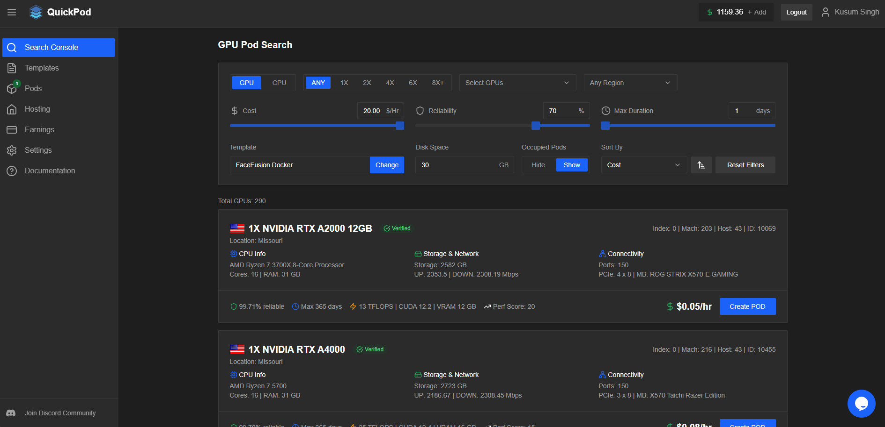

# Introduction

### What is the Console? 

The QuickPod console is a web application that is a user interface for using Quickpod Platform. Using it you can search avaliable machines, manage your instances, browse templates, view and edit your account information, purchase credit for using QuickPod, and much more. It has two modes user and host, users get to see GPU and CPU Search, hosts have additional hosting section where they can view the machines they are hosting and make changes to their listings.

### GPU Search 

This is the default page where users can browse for available GPU offers, you can think of an offer as a slice of the machine which is available and can be rented from this page. Before you can create PODs u will need to add credit and ideally set a ssh public key also to access the POD. We provide a webconnect also which can be used alternatively.

<figure><figcaption></figcaption></figure>

### CPU Search 

CPU Search is counterpart of GPU Search specifically for CPU only pod search. The navigation is similar to GPU Search, you can switch from a GPU search to a CPU search by using the buttons on the upper left hand corner of the screen.

<figure><figcaption></figcaption></figure>

### CPU and GPU Templates Page 

CPU and GPU templates page provides predefined public templates and your own custom templates. You can create a brand new template from Create Template link or clone a public template into your own account. Cloning may be needed to further customize the template with your own parameters.

<figure><figcaption></figcaption></figure>

### GPU and CPU Pods (Pods) 

GPU and CPU Pods page shows a list of all Pods of respective type under your account, there are options available to connect to the pod, see there status and console outputs. Stop, start and restart pod, or even destroy the pod when you no longer need it.

<figure><figcaption></figcaption></figure>

### GPU and CPU Machines (Hosting) 

GPU and CPU Machines page are for host mode only tied to a host type account, and provides way for Hosts to view and list their machines.

<figure><figcaption></figcaption></figure>
